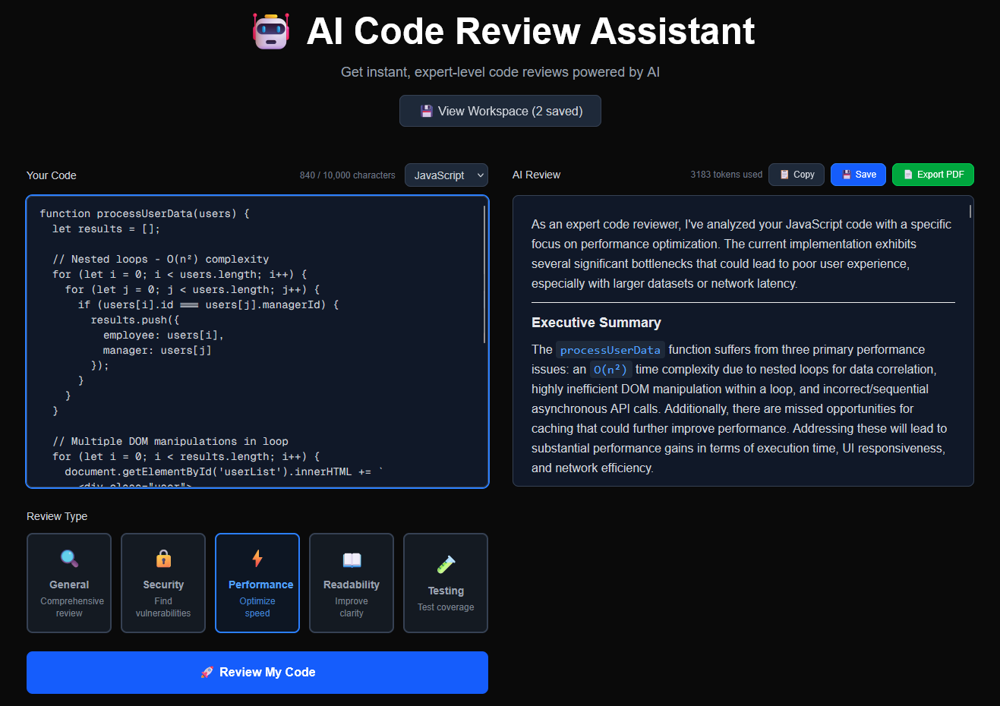
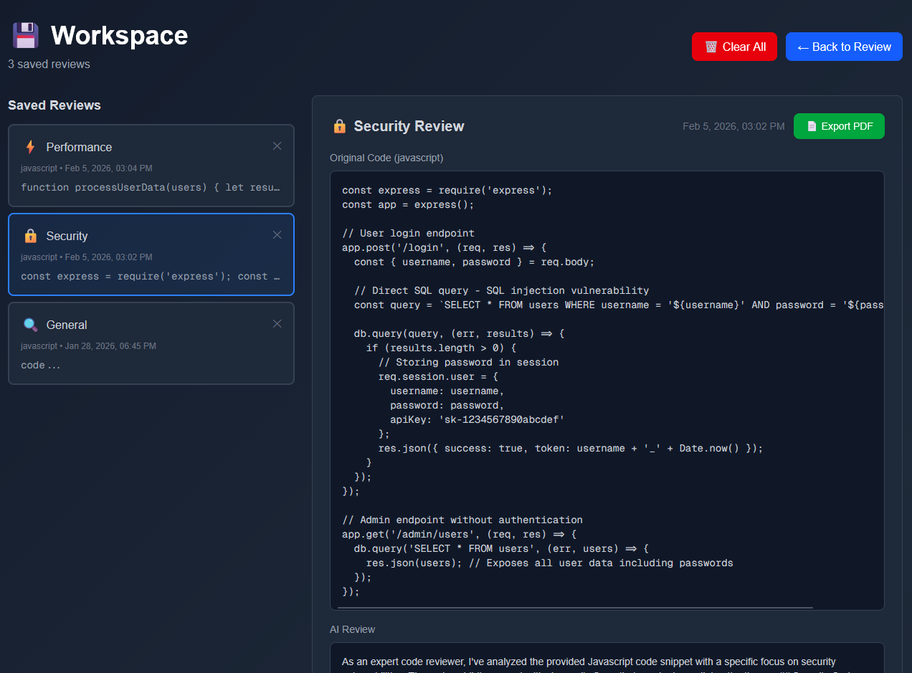
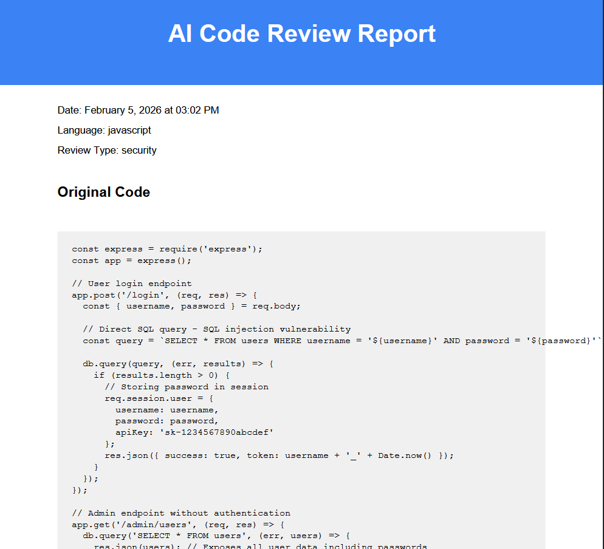

# 🤖 AI Code Review Assistant

<p align="center">
  <b>Instant AI-powered code reviews for better, safer, cleaner code.</b><br/>
  Get feedback on security, performance, readability, and testing in seconds.
</p>

<p align="center">
  <a href="https://aicodereviewerdemo.vercel.app/">
    
  </a>
  
  
  
  
  
</p>

---

## 🚀 Live Demo
👉 **Try it here:** https://aicodereviewerdemo.vercel.app/

---

## 📸 Screenshots

### 🖥️ Main Interface


### 📂 Workspace


### 📄 PDF Export


---

## ✨ Features

- 🔍 **Multiple Review Types**  
  General, Security, Performance, Readability, Testing

- 🌐 **Multi-Language Support**  
  JavaScript, TypeScript, Python, Java, C++, Go, Rust, PHP, Ruby, Swift

- 💾 **Workspace System**  
  Save and revisit your reviews locally

- 📄 **PDF Export**  
  Generate professional reports instantly

- ⚡ **Fast & Efficient**  
  Powered by Google Gemini 2.5 API

- 🎨 **Modern UI**  
  Clean, responsive design with Tailwind CSS

- 📊 **Token Tracking**  
  Monitor your API usage in real-time

---

## 🧠 How It Works

1. Paste your code
2. Select language & review type
3. Click **"Review My Code"**
4. Get instant AI feedback with actionable suggestions

---

## 🛠️ Tech Stack

| Category        | Technology |
|----------------|------------|
| Frontend       | Next.js 14 (App Router), React, TypeScript |
| Styling        | Tailwind CSS |
| AI Integration | Google Gemini 2.5 API |
| PDF Export     | jsPDF |
| Markdown       | react-markdown |

---

## ⚙️ Installation

```bash
git clone https://github.com/mariokonnari/AI-code-reviewer
cd ai-code-reviewer
npm install